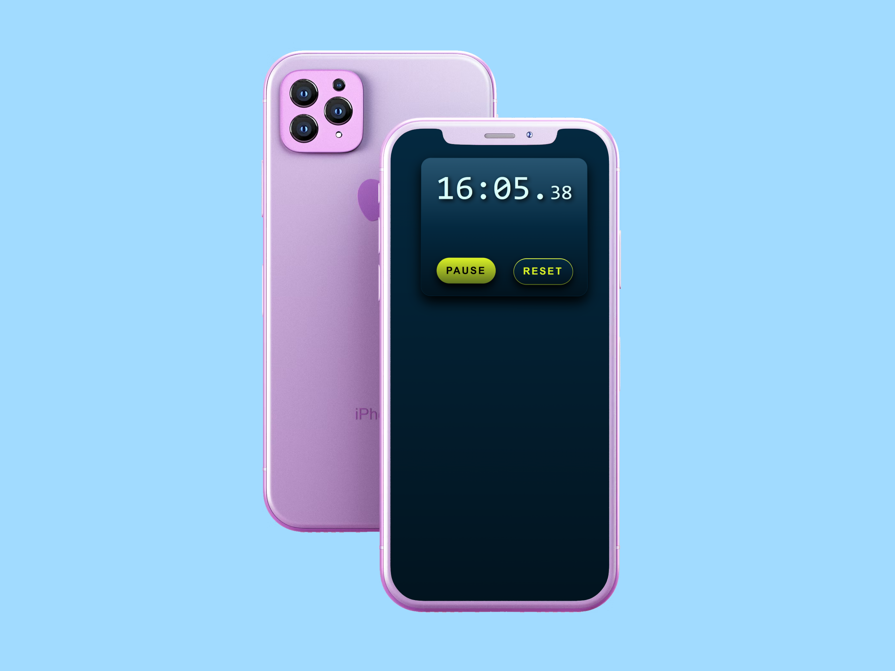

# ⏱️ Stopwatch App

A modern, minimalist stopwatch application built with React and TypeScript.

---

## 🚀 Live Demo

[**View Live App**](https://alena0490.github.io/Stopwatch/)

---

## 🛠️ Built With


---

## ✨ Features

- ⏱️ **Accurate timing** - Precise stopwatch functionality
- ▶️ **Start/Pause/Reset** - Full control over timing
- 🎨 **Modern UI** - Clean, gradient-based design
- 📱 **Responsive** - Works on all devices
- ⚡ **Fast** - Built with Vite for optimal performance
- 🎯 **Type-safe** - Written in TypeScript

---

## 📸 Screenshots

<!-- Mockup -->


---

## 🏃‍♀️ Getting Started

### Prerequisites

- Node.js (v18 or higher)
- npm or yarn

### Installation

1. Clone the repository

```bash
git clone https://github.com/Alena0490/Stopwatch.git
cd Stopwatch
```

2.Install dependencies

```bash
npm install
```

3.Run development server

```bash
npm run dev
```

4.Open [http://localhost:5173](http://localhost:5173) in your browser

---

## 🏗️ Build for Production

```bash
npm run build
```

---

## 🚀 Deploy to GitHub Pages

```bash
npm run deploy
```

---

## 📂 Project Structure

```Stopwatch/
├── public/              # Static assets (favicons)
├── src/
│   ├── components/      # React components
│   │   ├── StopWatch.tsx
│   │   ├── Timer.tsx
│   │   └── ControlButtons.tsx
│   ├── styles/          # CSS files
│   │   ├── StopWatch.css
│   │   ├── Timer.css
│   │   └── ControlButtons.css
│   ├── App.tsx          # Main app component
│   └── main.tsx         # Entry point
├── index.html
├── package.json
├── tsconfig.json
└── vite.config.ts
```

---

## 🎨 Color Palette

- **Primary:** `#005C53` - Deep teal
- **Secondary:** `#DBF227` - Lime yellow
- **Background:** `#042940` - Dark blue
- **Text:** `#D9FDF9` - Light cyan

---

## 📝 License

This project is open source and available under the [MIT License](LICENSE).

---

## 👩‍💻 Author

Alena Pumprová

- GitHub: [@Alena0490](https://github.com/Alena0490)

---

## 🙏 Acknowledgments

- Built as a learning project to practice React, TypeScript, and modern web development
- Favicon generated with [Favicon.io](https://favicon.io)

---

Made with ❤️ and ☕
